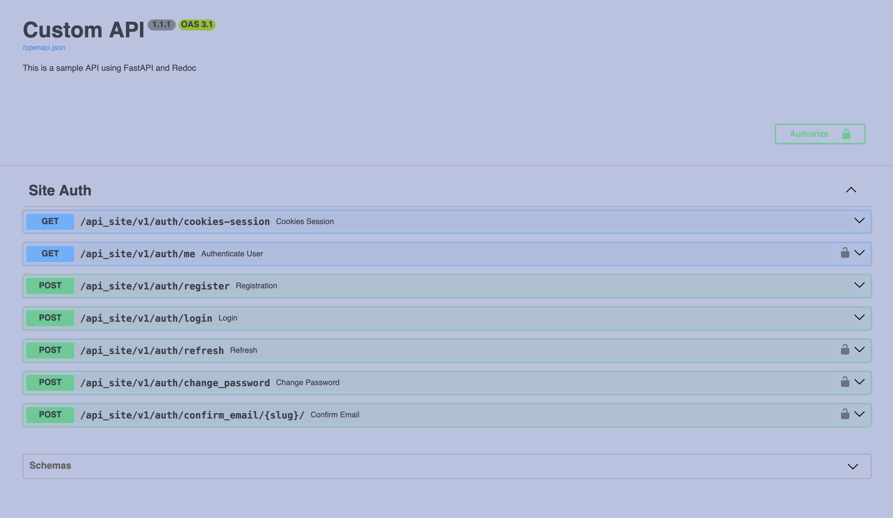

# Сервис аутентификации на FastAPI

Надежный сервис аутентификации, построенный на FastAPI, SQLAlchemy и JWT токенах.

## Возможности

- Регистрация и аутентификация пользователей
- JWT-аутентификация
- Хеширование паролей с помощью bcrypt
- Асинхронная работа с базой данных через SQLAlchemy 2.0
- Миграции базы данных с Alembic
- Конфигурация через переменные окружения
- Поддержка Docker
- Логирование в Loki

## Требования

- Python 3.12+
- Docker и Docker Compose
- Poetry (для управления зависимостями)

## Кастомизация

Кастомный Swagger UI `static/swagger-custom-ui.css`.



## Структура проекта

```
.
├── app/                            # Основной пакет приложения
│   └── api_site_v1/                # API
│       ├── auth/                   # Авторизация
│       |  ├── dependencies.py      # Зависимости эндпоинтов авторизации
│       |  └── views.py             # Эндпоинты авторизации
│       ├── depends.py              # Сервисы для авторизации
│       └── schemas.py              # Pydantic схемы
├── configs/                        # Файлы конфигурации
│   ├── log_config.ini              # Настройки root логгера fastapi
│   ├── loki-config.yaml            # Настройки Loki
│   └── promtail-config.yaml        # Настройки сборщика логов
├── core/                           # Основная функциональность
│   ├── models/                     # Модели базы данных
│   ├── config.py                   # Конфигурация
│   ├── logger.py                   # Конфигурация логирования
│   └── security.py                 # Сервисы безопасности
├── migrations/                     # Миграции базы данных (Alembic)
├── scripts/                        # Вспомогательные скрипты
│   ├── init_certs.sh               # Инициализация сертификатов
│   ├── init_db.sh                  # Инициализация базы данных
│   └── init_roles.py               # Инициализация ролей
├── static/                         # Статические файлы
│   ├── swagger-custom-ui.css       # Кастомизация Swagger UI
│   └── swagger-custom.png          # Пример кастомизации
├── tests/                          # Тесты
├── .dockerignore                   # Файл для игнорирования файлов в Docker
├── .gitignore                      # Файл для игнорирования файлов в Git
├── .env                            # Переменные окружения
├── alembic.ini                     # Конфигурация Alembic
├── docker-compose.yml              # Конфигурация Docker Compose
├── Dockerfile                      # Конфигурация Docker
├── main.py                         # Точка входа в приложение
├── poetry.lock                     # Зависимости и метаданные проекта
├── pyproject.toml                  # Зависимости и метаданные проекта
└── README.md                       # Документация проекта
```

## Начало работы

### 1. Клонируйте репозиторий

```bash
git clone https://github.com/powermacintosh/fastapi-auth.git
cd fastapi-auth
```

### 2. Настройте переменные окружения

#### Создайте файл .env в корневой директории и заполните значения

```bash
# Database
DB_ENGINE_SYNC = postgresql
DB_ENGINE_ASYNC = postgresql+asyncpg
DB_USERNAME = postgres
DB_PASS = postgres
DB_HOST = db
DB_NAME = test-auth-db

# Порт для PostgreSQL
POSTGRES_PORT=5432

# Loki
LOKI_URL = http://loki:3100/loki/api/v1/push
LOKI_PORT=3100

# Порт для FastAPI приложения
APP_PORT=5000

# Порт для Grafana
GRAFANA_PORT=3010
```

### 3. Запуск с помощью Docker-Compose (рекомендуется)

#### Запуск

```bash
docker-compose up -d                # Запуск в фоновом режиме
docker-compose up --build           # Запуск с пересборкой образов
```

#### Просмотр логов в реальном времени

```bash
docker-compose logs -f web          # Логи приложения
docker-compose logs -f promtail     # Логи promtail
docker-compose logs -f loki         # Логи loki
docker-compose logs -f grafana      # Логи grafana
```

#### Остановка

```bash
docker-compose stop                 # Остановка всех контейнеров
docker-compose down                 # Остановка и удаление всех контейнеров
docker-compose down -v              # Остановка и удаление всех контейнеров и томов
```

#### Документация API

После запуска приложения будут доступны:

- **Swagger UI**: `http://localhost:5000/docs`
- **ReDoc**: `http://localhost:5000/redoc`
- **OpenAPI JSON**: `http://localhost:5000/openapi.json`

- **Grafana**: `http://localhost:3010`

#### Grafana

`Логин` - admin
`Пароль` - admin (при первом входе)

#### Подключение к Loki

`URL` - http://loki:3100

#### Подключение к базе данных

`Host URL` - db:5432
`Database name` - test-auth-db

`Username` - postgres
`Password` - postgres

`TLS/SSL Mode` - disable

##### Основные запросы к базе данных

```sql
-- Все роли
SELECT * FROM roles;

-- Группы ролей
SELECT * FROM roles_groups;

-- Связи ролей и групп
SELECT * FROM roles_groups_associations;

-- Все пользователи (Включая незарегистрированных)
SELECT * FROM users_associations;

-- Все зарегистрированные пользователи
SELECT * FROM website_users;

-- Все профили
SELECT * FROM profiles;

-- Все профили с информацией о пользователях
SELECT p.*, u.email
FROM profiles p
JOIN users_associations ua ON p.id = ua.profile_id
JOIN website_users u ON ua.user_website_id = u.id;
```

## Разработка

### Тестирование

```bash
docker-compose run --rm test
```

## Лицензия

Проект распространяется под лицензией MIT - подробности см. в файле [LICENSE](LICENSE).
